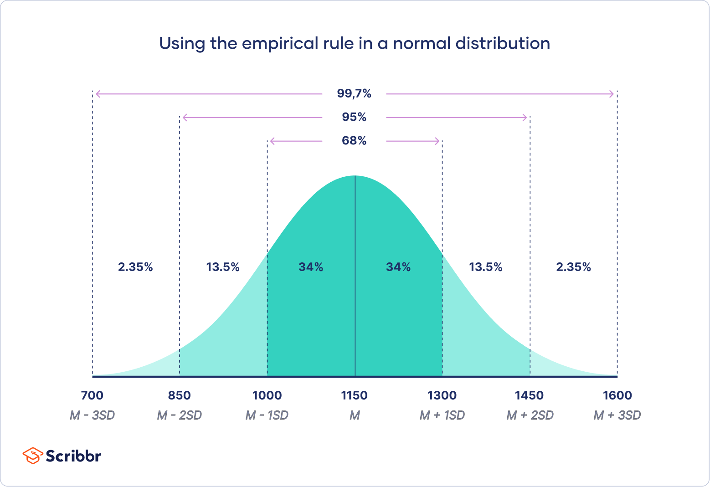

# Chapter 07: Basic Hypothesis Testing: t-tests, ANOVA, Mann-Whitney.

## 7.1 Hypothesis Testing

A hypothesis is a statement about a population parameter. The definition of a hypothesis is rather general, but the important point is that a hypothesis makes a statement about the population. The goal of a hypothesis test is to decide, based on a sample from the population, which of two complementary hypotheses is true.

The two complementary hypotheses in a hypothesis testing problem are called the null hypothesis and the alternative hypothesis. They are denoted by H0 and H1, respectively.


```{r}
# Load the built-in dataset
data(ToothGrowth)
# Rename it to look more concise
dataset <- ToothGrowth
# Display the first 6 (default) rows
head(dataset)
```

Null hypothesis (H0) - no difference in tooth length between groups (dose/supplementary type)

Alternative hypothesis (H1) - different dosage/supplementary type affect the tooth length


In a hypothesis testing problem, after observing the sample the experimenter must decide either to accept H0 as true or to reject H0 as false and decide H1 is true.


Type I error - test incorrectly rejects H0 hypothesis

Type II error - test decides to accept H0 hypothesis


Let's create a new column "combination" that contains all possible combinations of conditions
```{r}
library(dplyr)
df_cases <- dataset %>%
  group_by(dose, supp) %>% 
  mutate(combination = paste(supp, dose, sep = "_"))
```


New dataframe contains all "len" values for each combination
```{r}
list_values <- list()

for (comb in unique(df_cases$combination)) {
  
  clnm <- df_cases %>% 
    filter(combination == comb) %>% 
    pull(len)
  
  list_values[[comb]] <- clnm  
}

df <- as.data.frame(list_values)
```

```{r}
colnames(df)
```

That is how the data looks like

```{r}
boxplot(df, names=colnames(df),
        main="All groups", ylab="length")
```

## 7.2 Major tests for hypothesis testing

Traditionally all hypothesis tests divide in two groups:
`- parametric`
`- non-parametric`


```{r, echo=FALSE, out.width="50%", fig.cap="Parametric."}
knitr::include_graphics("pictures/parametric.png")
```

Parametric tests are for the data distributed in a known way!

The most popular distribution is "normal distribution". The most common tests for normal distribution are t-test and ANOVA.

```{r, echo=FALSE, out.width="50%", fig.cap="Normal distribution."}

```


But actually there are much more distributions and parametric tests to apply.


```{r, echo=FALSE, out.width="50%", fig.cap="Table of common distributions."}
knitr::include_graphics("pictures/distribution.jpg")
```

If the distribution is not known a non-parametric tests can be a solution.


```{r, echo=FALSE, out.width="50%", fig.cap="Non-arametric."}
knitr::include_graphics("pictures/non-parametric.png")
```

## 7.3 P-value

The p-value is the probability of observing results as extreme as, or more extreme than, the results actually observed, assuming that the null hypothesis is true.
In simpler terms, it tells you how likely your data would be if there were no actual effect or difference (i.e., if the null hypothesis is true).

```{r, echo=FALSE, out.width="50%", fig.cap="Non-arametric."}
knitr::include_graphics("pictures/p-value.jpg")
```
```
Low P-Value (typically ≤ 0.05): Indicates strong evidence against the null hypothesis, so you may reject the null hypothesis. A low p-value suggests that the observed data is unlikely under the null hypothesis, implying there may be a real effect or difference.
High P-Value (typically > 0.05): Indicates weak evidence against the null hypothesis, so you may fail to reject it. A high p-value means that the observed data is fairly likely under the null hypothesis, suggesting no significant effect or difference.
```

Suppose we're testing whether the mean tooth length for two supplement types, OJ and VC, are different (null hypothesis: their means are equal). If you perform a t-test and get a p-value of 0.03, you interpret this as follows:

    With a p-value of 0.03, there is a 3% chance of observing such a difference in means (or a more extreme difference) if the two supplement types actually have the same mean tooth length.
    Since 0.03 is less than 0.05 (the typical significance level), you would reject the null hypothesis and conclude that the difference in means is statistically significant.

Common Misconceptions

    A p-value is not the probability that the null hypothesis is true; it only tells you about the likelihood of observing your data if the null hypothesis were true.
    A small p-value does not imply a large effect size; it just indicates that the observed effect is unlikely under the null hypothesis. The magnitude of the effect should be assessed separately.

Typical Significance Level

    Researchers often use a significance level of 0.05, meaning that there is a 5% risk of incorrectly rejecting the null hypothesis (Type I error).
    This threshold is somewhat arbitrary, and in some fields, stricter thresholds (e.g., 0.01) are used to minimize the risk of false positives.


## 7.4 Parametric tests. 
### 7.4.1 t-test

t-test

A t-test is a statistical test used to determine if there is a significant difference between the means of two groups. It's commonly used in hypothesis testing when the sample sizes are small and the population standard deviation is unknown. 

Types of T-Test

    Independent t-test (two-sample t-test): Compares the means of two independent groups (e.g., comparing test scores between two different classes).
    Paired t-test: Compares means from the same group at different times (e.g., measuring the weight of individuals before and after a diet).
    One-sample t-test: Compares the mean of a single group against a known value or population mean (e.g., testing if the average height of a sample of students is different from the national average).

Assumptions

For the t-test to be valid, several assumptions should be met:

    Normality: The data should be approximately normally distributed, especially important for small sample sizes.
    Independence: For the independent t-test, the observations should be independent of each other.
    Equal Variances: For the independent t-test, the two groups should have similar variances (homogeneity of variance). If this assumption is violated, a variant called Welch’s t-test can be used, which does not assume equal variances.


```{r}
df
```


```{r}
t.test(df$VC_0.5, df$OJ_0.5, var.equal = T)
```


```{r}
t.test(df$VC_0.5, df$VC_1, var.equal = T)
```

### 7.4.2 ANOVA

ANOVA (Analysis of Variance) is a statistical technique used to compare the means of three or more groups to determine if at least one group mean is significantly different from the others. It’s widely used in experimental and observational studies when you want to test for differences among group means across multiple categories.

Main types of ANOVA

```
One-Way ANOVA: Used to test the effect of a single factor with multiple levels (e.g., comparing the effect of three different diets on weight loss).

Two-Way ANOVA: Used to examine the effects of two independent variables and their interaction on a dependent variable (e.g., testing the effect of both diet and exercise on weight loss).
```

Assumptions of ANOVA

```
Independence: Observations within each group should be independent of each other.

Normality: The data in each group should be approximately normally distributed, especially for small sample sizes.

Homogeneity of Variance: Variances across the groups should be roughly equal. When this assumption is violated, methods like Welch’s ANOVA can be used.
```

Limitations

```
ANOVA only tells you if there is a significant difference somewhere among the groups, not where. Post-hoc tests are needed for more details.

ANOVA assumes equal variances across groups, which may not always hold true.
```


```{r}
# Convert 'dose' to a factor, as it's a categorical variable
dataset$dose <- as.factor(dataset$dose)

# We analyze the effect of two factors, 'dose' and 'supp' (supplement type), on tooth length ('len'), so two-way ANOVA is used
result <- aov(len ~ supp * dose, data = dataset)

# View the summary of the ANOVA results
summary(result)
```
Post-hoc test is needed to establish the group(s) that differ
```{r}
TukeyHSD(result)
```
We can plot the results of pair-wise comparison

```{r}
par(mar = c(5, 10, 4, 2))  # Increase the left margin for longer labels
plot(TukeyHSD(result), las = 1)
```
The significant groupwise differences are any where the 95% confidence interval doesn’t include zero. This is another way of saying that the p value for these pairwise differences is < 0.05.

We can also proceed with one-way ANOVA

```{r}
# Convert 'dose' to a factor, as it's a categorical variable
dataset$dose <- as.factor(dataset$dose)

# Filtering one supplement type 
vc <- dataset %>%
  filter(supp == "VC")

# We analyze the effect of one factor, 'dose' on tooth length ('len'), so one-way ANOVA is used here
result <- aov(len ~ dose, data = vc)

# View the summary of the ANOVA results
summary(result)
```

```{r}
TukeyHSD(result)
```

```{r}
par(mar = c(5, 10, 4, 2))  # Increase the left margin for longer labels
plot(TukeyHSD(result), las = 1)
```

## 7.5 Non-parametric tests

Non-parametric tests are statistical tests that do not assume a specific distribution for the data, making them suitable for analyzing data that are not normally distributed or have unknown distributions. 

### 7.5.1 Mann-Whitney U Test

Usually used to compare two independent groups (as an alternative to the independent samples t-test when the data are not normally distributed)

```{r warning=FALSE}
# Mann-Whitney U Test between VC and OJ groups
wilcox.test(len ~ supp, data = dataset)
```


### 7.5.2 Wilcoxon Signed-Rank Test

Compares two related groups or matched samples (alternative to the paired t-test for non-normally distributed data).

(Tumor growth in the same group of animals before and after treatment)

```{r warning=FALSE}
# Groups from ToothGrowth are not related, so it is incorrect to make any assumptions from this data. It is just an example how to run the test!
dose_1mg <- dataset %>% 
  filter(dose == 1)
wilcox.test(len ~ supp, data = dose_1mg)
```


### 7.5.3 Kruskal-Wallis Test

Compares three or more independent groups. Non-parametric alternative to one-way ANOVA when data do not meet ANOVA assumptions.

```{r}
# Kruskal-Wallis Test for 'dose'
vc <- dataset %>% filter(supp == "VC")
kruskal.test(len ~ dose, data = vc)

# Kruskal-Wallis Test for 'supp'
dose_1mg <- dataset %>% filter(dose == 1)
kruskal.test(len ~ supp, data = dose_1mg)
```
```{r warning=FALSE}
# Perform pairwise Wilcoxon tests for each combination of supplement and dose
pairwise_results <- pairwise.wilcox.test(dataset$len, 
                                          interaction(dataset$dose, dataset$supp),
                                          p.adjust.method = "bonferroni")

# View the results
print(pairwise_results)
```
```{r warning=FALSE}
# Perform pairwise Wilcoxon tests for each combination of supplement and dose
pairwise_results <- pairwise.wilcox.test(dataset$len, 
                                          interaction(dataset$dose, dataset$supp),
                                          p.adjust.method = "none")

# View the results
print(pairwise_results)
```

### Conclusion

In this chapter we discussed basic hypothesis testing approaches and terms. We demonstrated how the most popular tests can be applied for data analysis and when the particular test can be appropriate.


